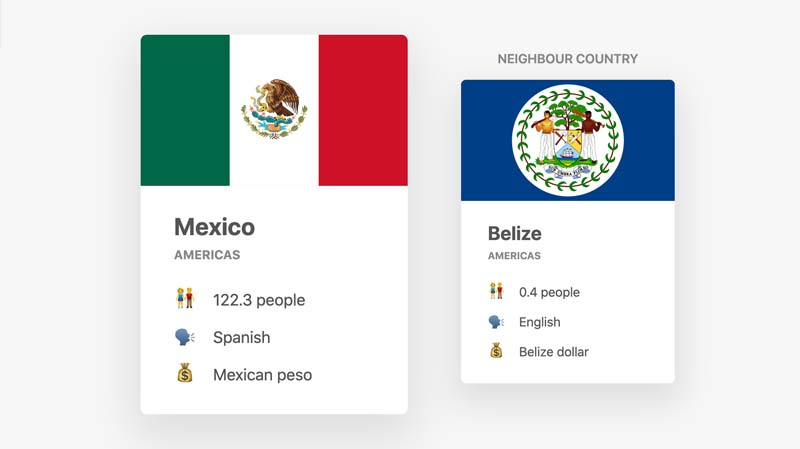

# js-country-flags

This app uses the [RESTCountries API](https://restcountries.eu/) to find a country and it's neighbor country and display both of their flags in the UI.

## How Its Done

It uses the fetch api to get a data response then based on the result of that data, does another fetch to find the neighbor country.

### script.js

This is the final refactored script that abstracted out the fetch and first then method (w/error handling). Since we repeated the code it was removed and put into a new function called getJSON. That greatly reduced the lines of code.

### FetchExample2.js

This is a full demo of how I used the fetch api before refactoring to the script.js file.
### whereAmI.js

This is a full demo of the whereAmI application. It's very similar in that it uses a nested fetch api and handles both resolves and rejections. In this app, a set of latitude and longitude coordinates are passed in as string parameters to the whereAmI function. The function first uses the GEOCODE API (for reverse geocoding). Based on those coordinates it finds the location. That location data is then passed to another API called RESTCountries. Then that data is used to display the country's flag and data.
